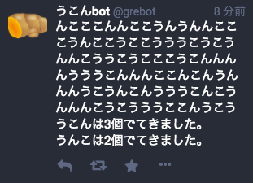

Ukon Bot for Mastodon
======================

Bot on [mstdn.jp](mstdn.jp): [@grebot](https://mstdn.jp/@grebot)



## Setting up

* Get access token of the API (Refer to [here](https://github.com/tootsuite/documentation/blob/master/Using-the-API/Testing-with-cURL.md)).
* Install `curl`
* Put `execute.sh` on the server and set cronjob.

## Cronjob

```
# Execute every 10 minutes.
*/10 * * * * bash /path/to/this/repository/execute.sh
```

## LICENSE

This is available as open source under the terms of the [MIT License](http://opensource.org/licenses/MIT).
Image icon is from [いらすとや](http://www.irasutoya.com/2014/12/blog-post_7.html).
